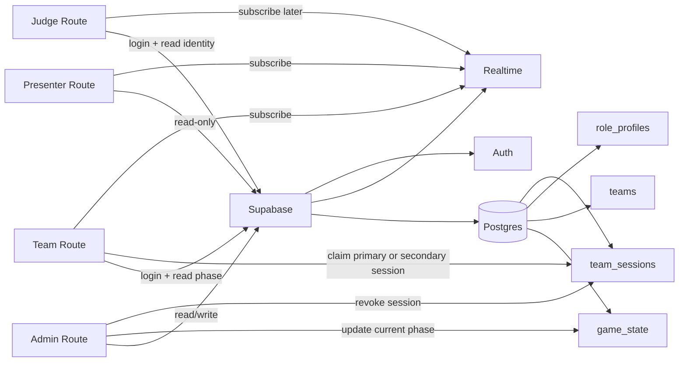
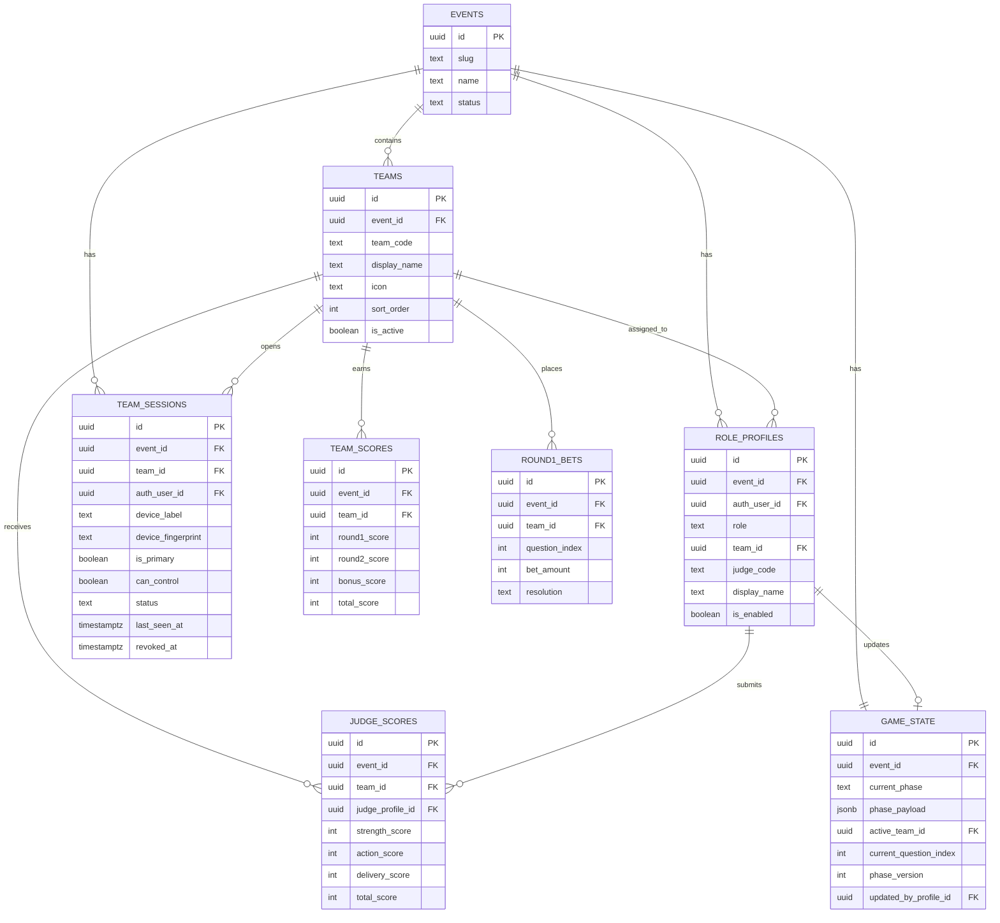

# Supabase Schema And Architecture Draft

## Mục tiêu của phase `004`

Phase này chỉ giải quyết 3 thứ nền:

1. Shared game state cho toàn event
2. Role login và session policy
3. Realtime sync tối thiểu giữa admin, presenter, team, judge

Phase này **chưa** implement:

- Round 1 betting/marking đầy đủ
- Round 2 judge scoring đầy đủ
- Bonus scoring orchestration

---

## Architecture Draft



### Ý tưởng chính

- `Supabase Auth` lo identity đăng nhập
- `Postgres` giữ source of truth cho event state
- `Realtime` đẩy phase update sang presenter/team
- `team_sessions` là nơi xử lý policy nhiều máy nhưng chỉ 1 primary controller

---

## Recommended Table Set

### 1. `events`

Giữ một event row cho mỗi lần chạy game.  
Với scope hiện tại chỉ có thể có đúng 1 event active, nhưng vẫn nên có table này để tránh hardcode toàn hệ thống vào một row vô danh.

| Column | Type | Notes |
|---|---|---|
| `id` | uuid pk | event id |
| `slug` | text unique | ví dụ `ueh-softskills-2026` |
| `name` | text | tên event |
| `status` | text | `draft`, `live`, `finished` |
| `created_at` | timestamptz | mặc định `now()` |
| `updated_at` | timestamptz | mặc định `now()` |

---

### 2. `teams`

Danh sách 9 đội/phòng ban.

| Column | Type | Notes |
|---|---|---|
| `id` | uuid pk | team row id |
| `event_id` | uuid fk -> events.id | event owner |
| `team_code` | text unique | ví dụ `finance`, `marketing` |
| `display_name` | text | tên hiển thị |
| `icon` | text | icon hiện tại từ prototype |
| `sort_order` | int | thứ tự hiển thị |
| `is_active` | boolean | có dùng trong event này không |
| `created_at` | timestamptz | mặc định `now()` |

Ghi chú:
- `team_code` nên map thẳng với route `/team/:teamId`
- dữ liệu này có thể seed từ `src/data/teams.js`

---

### 3. `role_profiles`

Map giữa `auth.users` và role thực tế trong event.  
Table này là nơi phân biệt admin, judge, team account.

| Column | Type | Notes |
|---|---|---|
| `id` | uuid pk | profile id |
| `event_id` | uuid fk -> events.id | event owner |
| `auth_user_id` | uuid unique fk -> auth.users.id | user auth |
| `role` | text | `admin`, `judge`, `team` |
| `team_id` | uuid nullable fk -> teams.id | chỉ dùng cho team |
| `judge_code` | text nullable | ví dụ `judge-1` |
| `display_name` | text | tên hiển thị |
| `is_enabled` | boolean | có cho login không |
| `created_at` | timestamptz | mặc định `now()` |

### Vì sao dùng `role_profiles` thay vì nhiều table role riêng

- đơn giản hơn cho event nhỏ
- cùng một pattern auth cho mọi role
- dễ kiểm tra permission từ một bảng trung tâm

---

### 4. `game_state`

Source of truth cho phase toàn event.

| Column | Type | Notes |
|---|---|---|
| `id` | uuid pk | row id |
| `event_id` | uuid unique fk -> events.id | mỗi event có 1 row game_state active |
| `current_phase` | text | ví dụ `lobby`, `round1_question_open`, `round2_discussion`, `results` |
| `phase_payload` | jsonb | metadata nhẹ cho phase hiện tại |
| `active_team_id` | uuid nullable fk -> teams.id | đội đang pitch nếu có |
| `current_question_index` | int nullable | phục vụ Round 1 sau này |
| `phase_version` | int | tăng dần để detect stale writes |
| `updated_by_profile_id` | uuid nullable fk -> role_profiles.id | ai update cuối |
| `updated_at` | timestamptz | mặc định `now()` |

### `phase_payload` nên chứa gì

Ở `004`, chỉ nên chứa metadata nhỏ:

```json
{
  "label": "Round 1 - Cau 1",
  "timerSeconds": 30,
  "round": "round1"
}
```

Không nên nhét mọi state vòng chơi vào đây từ đầu.

---

### 5. `team_sessions`

Table quan trọng nhất của policy nhiều máy.

| Column | Type | Notes |
|---|---|---|
| `id` | uuid pk | session row id |
| `event_id` | uuid fk -> events.id | event owner |
| `team_id` | uuid fk -> teams.id | đội nào |
| `auth_user_id` | uuid fk -> auth.users.id | cùng team account có thể có nhiều session rows |
| `device_label` | text nullable | laptop, phone, etc |
| `device_fingerprint` | text nullable | fingerprint nhẹ hoặc generated client id |
| `is_primary` | boolean | máy chính |
| `can_control` | boolean | có quyền thao tác gameplay |
| `status` | text | `active`, `revoked`, `expired` |
| `last_seen_at` | timestamptz | heartbeat nhẹ |
| `revoked_at` | timestamptz nullable | admin revoke lúc nào |
| `created_at` | timestamptz | mặc định `now()` |

### Rule đề xuất

- session đầu tiên của một team:
  - `is_primary = true`
  - `can_control = true`
- session tiếp theo:
  - `is_primary = false`
  - `can_control = false`
  - `status = active`
- khi admin revoke:
  - `status = revoked`
  - `can_control = false`

---

## Deferred Tables

Những table này **chưa cần** ở `004`, nhưng gần như chắc sẽ có ở phase sau:

### `round1_bets`

| Column | Type | Notes |
|---|---|---|
| `id` | uuid pk | |
| `event_id` | uuid fk | |
| `team_id` | uuid fk | |
| `question_index` | int | |
| `bet_amount` | int | |
| `resolution` | text nullable | `correct`, `wrong` |
| `created_at` | timestamptz | |

### `judge_scores`

| Column | Type | Notes |
|---|---|---|
| `id` | uuid pk | |
| `event_id` | uuid fk | |
| `team_id` | uuid fk | |
| `judge_profile_id` | uuid fk -> role_profiles.id | |
| `strength_score` | int | rubric part |
| `action_score` | int | rubric part |
| `delivery_score` | int | rubric part |
| `total_score` | int generated or stored | |
| `created_at` | timestamptz | |

### `team_scores`

Materialized/authoritative total theo từng đội, để presenter và leaderboard đọc nhanh.

| Column | Type | Notes |
|---|---|---|
| `id` | uuid pk | |
| `event_id` | uuid fk | |
| `team_id` | uuid fk | |
| `round1_score` | int | |
| `round2_score` | int | |
| `bonus_score` | int | |
| `total_score` | int | |
| `updated_at` | timestamptz | |

---

## ER Draft



---

## Access Model Draft

### Admin

- read/write:
  - `events`
  - `game_state`
  - `teams`
  - `team_sessions`
- read:
  - `role_profiles`
- later write:
  - `round1_bets`
  - `team_scores`

### Presenter

- read-only:
  - `game_state`
  - `teams`
  - later `team_scores`

### Team

- read:
  - own `team` record
  - shared `game_state`
  - own `team_sessions`
  - later own bet/score state
- write:
  - own `team_sessions` heartbeat
  - later own round interactions if `can_control = true`

### Judge

- read:
  - own identity/profile
  - shared `game_state`
- later write:
  - own `judge_scores`

---

## Chỗ cần cẩn thận nhất

### 1. Primary session race condition

Nếu 2 máy cùng login gần như cùng lúc, không nên để frontend tự quyết ai là primary.  
Chỗ này gần như chắc nên xử lý bằng:

- RPC / SQL function
- hoặc transaction-backed claim logic

### 2. Không để browser giữ source of truth

Local storage chỉ là convenience.  
`game_state` và `team_sessions` mới là source of truth.

### 3. Không dùng service role trên client

Frontend chỉ dùng public client key.  
Mọi action nhạy như revoke session hoặc claim primary nên đi qua access model đúng, không hardcode secret.

---

## Recommendation

Nếu bạn hỏi “schema đầu tiên nên bắt đầu từ đâu”, mình khuyên:

### Bắt buộc cho `004`

- `events`
- `teams`
- `role_profiles`
- `game_state`
- `team_sessions`

### Chưa cần tạo ngay trong commit đầu của `004`

- `round1_bets`
- `judge_scores`
- `team_scores`

Như vậy phase đầu của Supabase sẽ đủ nhỏ để verify, nhưng không tự khóa tương lai.
